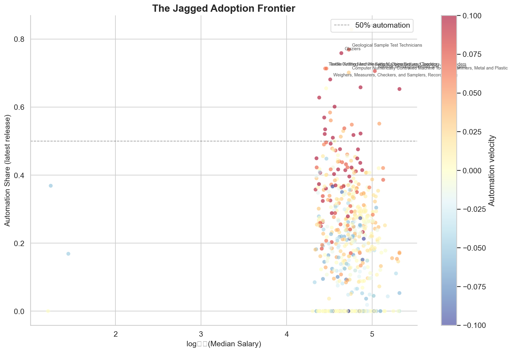
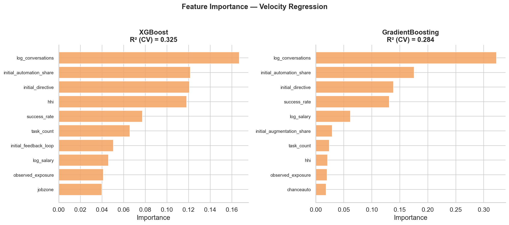
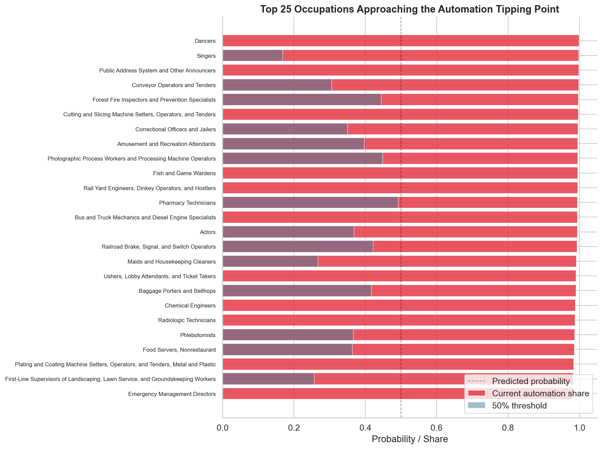

# The Jagged Adoption Frontier

**Predicting which occupations will shift from AI augmentation to automation**

An empirical analysis of Anthropic's [Economic Index](https://www.anthropic.com/economic-index) data, investigating which occupations are on the verge of tipping from human-AI collaboration to AI-driven automation.



## Motivation

Anthropic's Economic Index has documented a striking trend: automation usage on Claude overtook augmentation for the first time in mid-2025. But this aggregate trend masks enormous variation across occupations. Some occupations have rapidly shifted toward automation via directive AI use, while others remain stubbornly augmentative despite heavy AI adoption.

This project builds a predictive model of which occupations are most likely to cross the **automation tipping point** — the threshold where AI-driven automation becomes the dominant mode of use — and validates it against a year of temporal data from Anthropic's releases.

The question matters to AI labs designing systems, policymakers anticipating workforce transitions, and economists modeling the future of work.

## Key Findings

### 1. The frontier is genuinely jagged

Wage — a common proxy for task complexity — is a weak predictor of which occupations automate. Low-wage occupations like correctional officers and high-wage ones like chemical engineers both appear near the tipping point. This challenges simple narratives about AI automating cheap labor first and echoes Dell'Acqua et al.'s (2023) finding of a "jagged technological frontier."

### 2. Conversation volume is the strongest predictor of automation velocity

Occupations with more AI usage are more likely to shift toward automation. This suggests a **deepening dynamic**: familiarity with AI drives the augmentation-to-automation transition, not just the intrinsic nature of the work.



### 3. Twenty-one occupations have already tipped

During our 12-month observation window (March 2025 – March 2026), 21 occupations crossed from augmentation-dominant to automation-dominant AI use, including occupational health specialists, timing device assemblers, and animal control workers.

### 4. The model identifies the next wave

Using occupational characteristics from the earliest data release to predict later automation shifts, our best model achieves:
- **R² = 0.33** for predicting automation velocity (XGBoost, 5-fold CV)
- **AUC = 0.77** for classifying whether an occupation is shifting toward automation (Logistic Regression, 5-fold CV)



### 5. Task success drives the transition

Occupations where AI succeeds more often are more likely to shift toward automation. Demonstrated AI competence — not just theoretical capability — appears to drive the augmentation → automation transition.

## Data

All data is publicly available and downloaded automatically when running the notebooks.

| Source | Description | Records |
|--------|-------------|---------|
| [Anthropic Economic Index](https://huggingface.co/datasets/Anthropic/EconomicIndex) | 4 releases (Mar 2025 – Mar 2026) with per-task collaboration mode shares, AI autonomy scores, task success rates | ~1M rows |
| [O\*NET](https://www.onetonline.org/) | Task statements mapped to 974 occupations via SOC codes | 19,530 tasks |
| [BLS OEWS](https://www.bls.gov/oes/) | Wage and employment data by occupation | 1,090 occupations |

The Anthropic Economic Index classifies every Claude conversation into one of five collaboration modes:

| Mode | Category | Description |
|------|----------|-------------|
| **Directive** | Automation | AI provides complete autonomous execution |
| **Feedback loop** | Automation | Iterative AI-driven refinement |
| **Validation** | Augmentation | Human validates AI output |
| **Task iteration** | Augmentation | Human iterates on AI drafts |
| **Learning** | Augmentation | Human learns from AI insights |

## Methodology

**Panel construction.** We build a task-level panel across four AEI releases, mapping each task to occupations via O\*NET SOC codes. For each occupation × release, we compute the share of AI conversations in automative vs. augmentative modes.

**Feature engineering.** For each occupation, we compute:
- *Automation velocity*: slope of automation share over time
- *Initial state*: collaboration mode distribution in the earliest release
- *Task characteristics*: count, concentration (HHI), success rate, AI autonomy level
- *Economic characteristics*: median wage, job zone, observed AI exposure

**Modeling.** We train gradient boosted trees (XGBoost, sklearn GBR), logistic regression, and random forests, validated via 5-fold cross-validation. We use temporal holdout implicitly: features come from early releases, targets from the full time series.

**Ranking.** For currently augmentation-dominant occupations, we score their predicted probability of shifting toward automation.

## Limitations

- **Observational, not causal.** We identify predictive associations, not mechanisms. Conversation volume predicting automation velocity could reflect selection (occupations suitable for automation attract more usage) rather than a causal deepening effect.
- **Single platform.** The data reflects Claude usage on Anthropic's platform only. Occupations may have different automation patterns on other AI systems.
- **Short time horizon.** Four releases over 12 months provides limited temporal variation. The velocity estimates are noisy for occupations with few conversations.
- **Classification accuracy.** The collaboration mode classifier (which generates the underlying data) has its own error rate, adding noise to our signal.
- **Sample selection.** Occupations represented in Claude conversations are not a random sample of the labor market — they skew toward knowledge work.

## Project Structure

```
├── README.md
├── requirements.txt
├── notebooks/
│   ├── 01_data_acquisition.ipynb   # Download and inspect all data sources
│   ├── 02_exploration.ipynb        # EDA and the jagged frontier visualization
│   ├── 03_modeling.ipynb           # Model training and evaluation
│   └── 04_analysis.ipynb          # Tipping point ranking and implications
├── src/
│   ├── data.py                     # Data download, loading, panel construction
│   ├── features.py                 # Feature engineering pipeline
│   └── model.py                    # Model training, evaluation, ranking
├── data/
│   └── README.md                   # Data source documentation
└── figures/                        # Generated visualizations
```

## Reproducing

```bash
git clone https://github.com/alvinekelund/AI-vin-Index.git
cd AI-vin-Index
pip install -r requirements.txt
```

Run the notebooks in order — data downloads automatically on first execution:

```bash
jupyter notebook notebooks/01_data_acquisition.ipynb
```

Or execute all notebooks from the command line:

```bash
jupyter nbconvert --execute notebooks/01_data_acquisition.ipynb --to notebook
jupyter nbconvert --execute notebooks/02_exploration.ipynb --to notebook
jupyter nbconvert --execute notebooks/03_modeling.ipynb --to notebook
jupyter nbconvert --execute notebooks/04_analysis.ipynb --to notebook
```

## References

- Anthropic. (2025–2026). *The Anthropic Economic Index.* [anthropic.com/economic-index](https://www.anthropic.com/economic-index)
- Acemoglu, D. (2024). *The Simple Macroeconomics of AI.* NBER Working Paper 32487.
- Brynjolfsson, E., Li, D., & Raymond, L. R. (2023). *Generative AI at Work.* NBER Working Paper 31161.
- Dell'Acqua, F., et al. (2023). *Navigating the Jagged Technological Frontier.* Harvard Business School Working Paper 24-013.
- Eloundou, T., Manning, S., Mishkin, P., & Rock, D. (2023). *GPTs are GPTs.* arXiv:2303.10130.

## License

This project is released under the MIT License. The underlying data is provided by Anthropic, O\*NET, and BLS under their respective terms.
