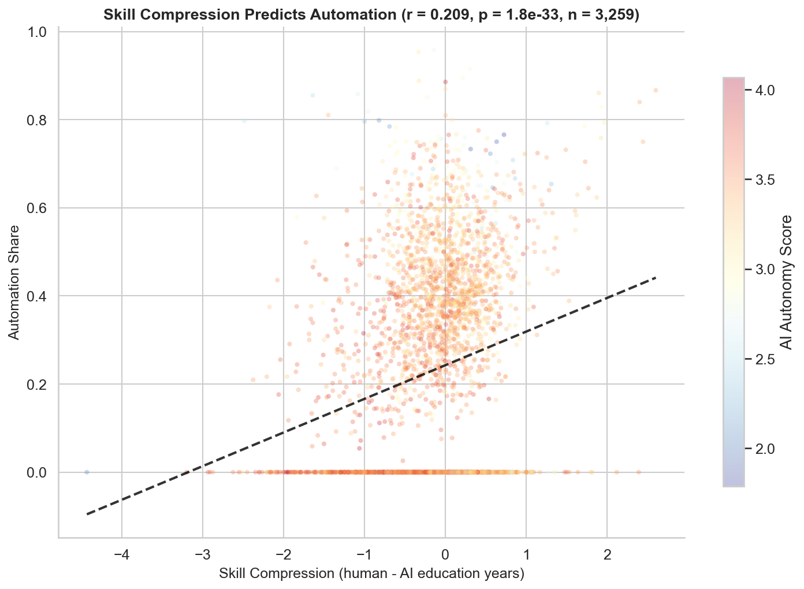
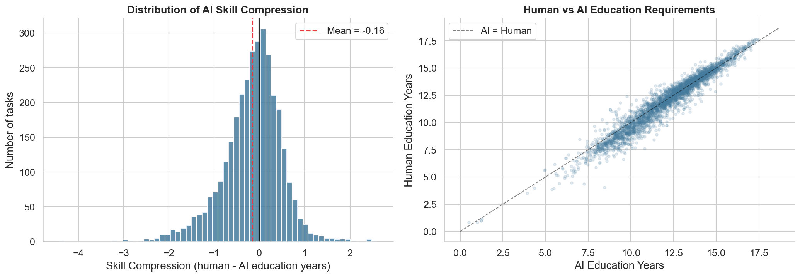
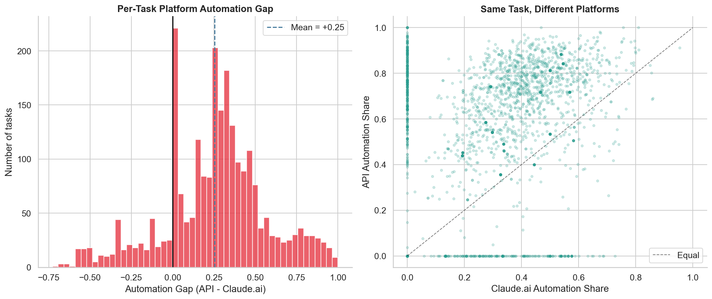
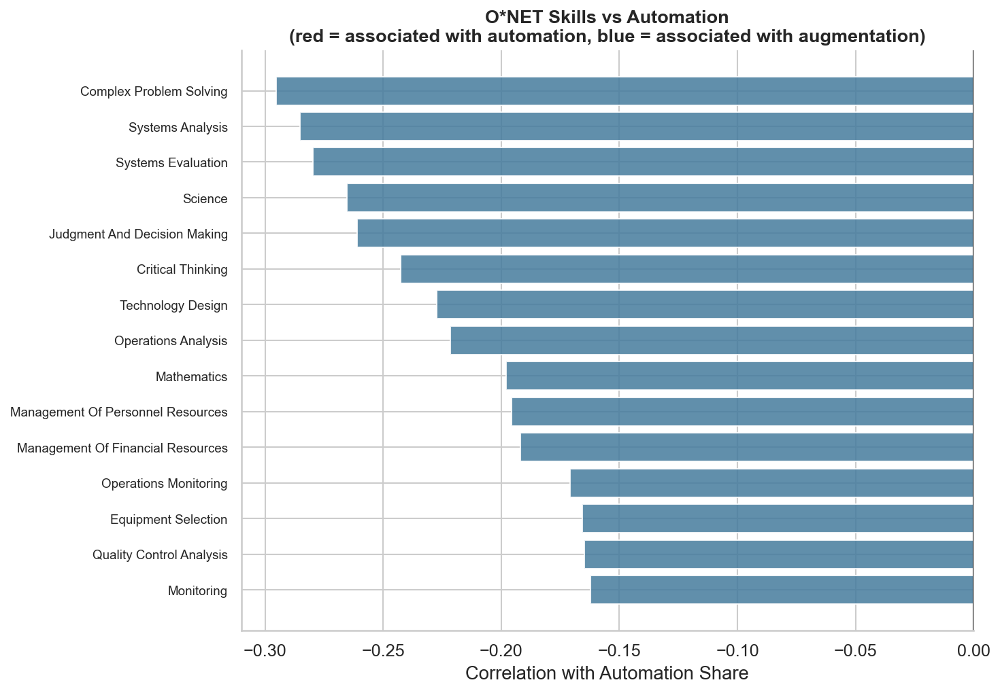
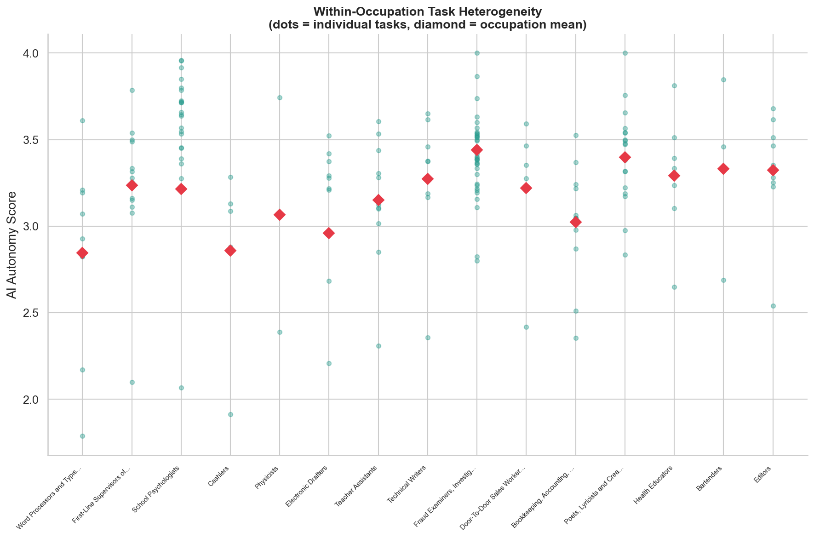

# The Jagged Adoption Frontier

**Where does AI automate — and where does it augment? A task-level analysis of 3,259 occupational tasks using Anthropic's Economic Index.**

The standard approach in AI labor economics analyzes automation at the occupation level. This project shows why that fails: tasks within the same occupation have wildly different automation patterns. By moving the analysis to the **task level**, we recover predictive signal that occupation-level aggregation destroys.



## Key Findings

### 1. The signal lives at task level, not occupation level

Predicting automation trajectories at the occupation level yields R^2 ~ 0 after proper cross-validation. But predicting AI autonomy at the task level yields **R^2 = 0.29** (5-fold CV, n = 3,259 tasks). The 10x increase in observations and the use of continuous outcome variables recovers real signal.

### 2. AI Skill Compression predicts automation

We introduce *skill compression* — the gap between how many years of education a human needs for a task vs. how much equivalent training the AI needs. Tasks with higher skill compression (AI needs less education) show significantly more automation (r = 0.21, p < 10^-33). But these tasks also show *lower* AI autonomy — suggesting AI democratizes access rather than replacing humans.



### 3. Platform determines automation mode

The same task looks very different on API vs. Claude.ai. Across 2,429 matched tasks, API automation share averages **+25 percentage points** higher than Claude.ai. The deployment channel matters far more than the occupation.



### 4. Task success inversely predicts automation

The strongest single correlation in the data: tasks with lower measured success rates have higher automation shares (r = -0.44, p < 10^-100). Automated (directive) tasks involve less human quality control, making success harder to verify.

### 5. O\*NET skills predict automation resistance

Occupation-level skill profiles from O\*NET — particularly complex problem solving, critical thinking, and social perceptiveness — predict which occupations resist automation better than wage does.



### 6. Within-occupation heterogeneity explains the null result

The occupation-level null result is not noise — it's a *finding*. Tasks within the same occupation have wildly different AI autonomy scores. This within-occupation variance directly causes the occupation-level prediction failure and quantifies the "jagged frontier" from Dell'Acqua et al. (2023).



## Data

All data is publicly available and downloaded automatically.

| Source | Description |
|--------|-------------|
| [Anthropic Economic Index](https://huggingface.co/datasets/Anthropic/EconomicIndex) | 4 releases (Mar 2025 -- Mar 2026): per-task AI autonomy, education years, time estimates, collaboration modes, success rates |
| [O\*NET](https://www.onetonline.org/) | 19,530 task statements mapped to 974 occupations + 35 skill ratings per occupation |
| [BLS OEWS](https://www.bls.gov/oes/) | Wage and employment data by occupation |

## Methodology

**Task-level analysis.** Rather than aggregating to occupations (which destroys signal), we analyze 3,259 unique tasks with rich continuous measures: AI autonomy scores, human and AI education year estimates, time estimates, task success rates, collaboration mode distributions, and human-only ability fractions.

**Skill compression.** For each task, we compute `human_education_years - ai_education_years`. This novel metric quantifies how much AI reduces the expertise barrier for specific tasks.

**Predictive modeling.** XGBoost and Gradient Boosting models predict task-level AI autonomy from task characteristics. Cross-validated R^2 = 0.29 — modest but real, compared to R^2 ~ 0 at the occupation level.

**Platform comparison.** We compare the same tasks across Claude.ai (interactive) and API (programmatic) platforms, measuring per-task automation divergence.

**Skill profiling.** O\*NET skill importance ratings (35 skills per occupation) are used to identify which occupational skill profiles predict automation resistance.

## Project Structure

```
├── README.md
├── requirements.txt
├── notebooks/
│   ├── 01_data_acquisition.ipynb   # Download, quality assessment, variable richness
│   ├── 02_skill_compression.ipynb  # AI Skill Compression metric and analysis
│   ├── 03_task_level_analysis.ipynb # Predictive models, platform gap, correlations
│   ├── 04_jagged_frontier.ipynb    # Within-occupation heterogeneity, O*NET skills
│   └── 05_synthesis.ipynb          # Aggregation, tipping candidates, summary
├── src/
│   ├── data.py                     # Data download, loading, task feature matrix
│   ├── features.py                 # Feature engineering (task + occupation level)
│   └── model.py                    # Predictive models (task + occupation level)
├── data/
│   └── README.md                   # Data source documentation
└── figures/                        # 16 generated visualizations
```

## Reproducing

```bash
git clone https://github.com/alvinekelund/AI-vin-Index.git
cd AI-vin-Index
pip install -r requirements.txt
```

Run the notebooks in order — data downloads automatically:

```bash
jupyter nbconvert --execute notebooks/01_data_acquisition.ipynb --to notebook
jupyter nbconvert --execute notebooks/02_skill_compression.ipynb --to notebook
jupyter nbconvert --execute notebooks/03_task_level_analysis.ipynb --to notebook
jupyter nbconvert --execute notebooks/04_jagged_frontier.ipynb --to notebook
jupyter nbconvert --execute notebooks/05_synthesis.ipynb --to notebook
```

## References

- Anthropic. (2025--2026). *The Anthropic Economic Index.* [anthropic.com/economic-index](https://www.anthropic.com/economic-index)
- Dell'Acqua, F., et al. (2023). *Navigating the Jagged Technological Frontier.* Harvard Business School Working Paper 24-013.
- Eloundou, T., Manning, S., Mishkin, P., & Rock, D. (2023). *GPTs are GPTs.* arXiv:2303.10130.
- Acemoglu, D. (2024). *The Simple Macroeconomics of AI.* NBER Working Paper 32487.
- Brynjolfsson, E., Li, D., & Raymond, L. R. (2023). *Generative AI at Work.* NBER Working Paper 31161.

## License

MIT License. The underlying data is provided by Anthropic, O\*NET, and BLS under their respective terms.
