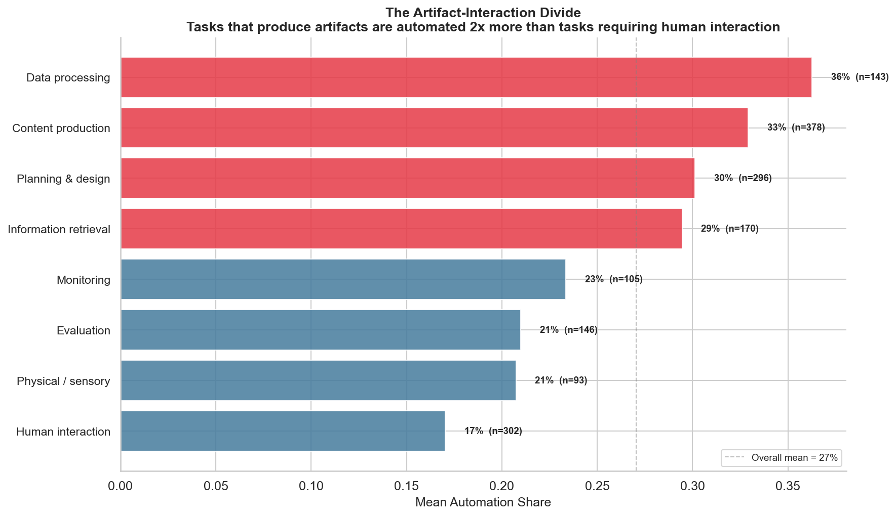
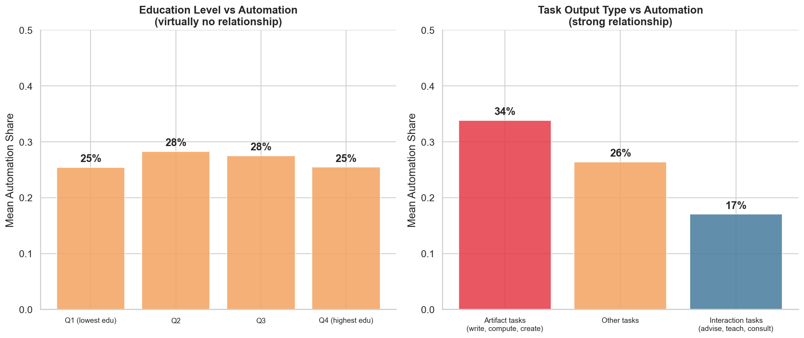
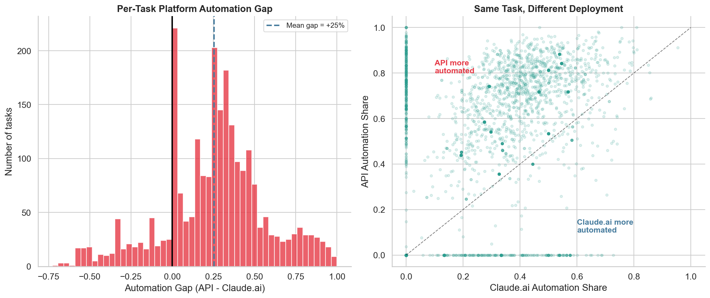
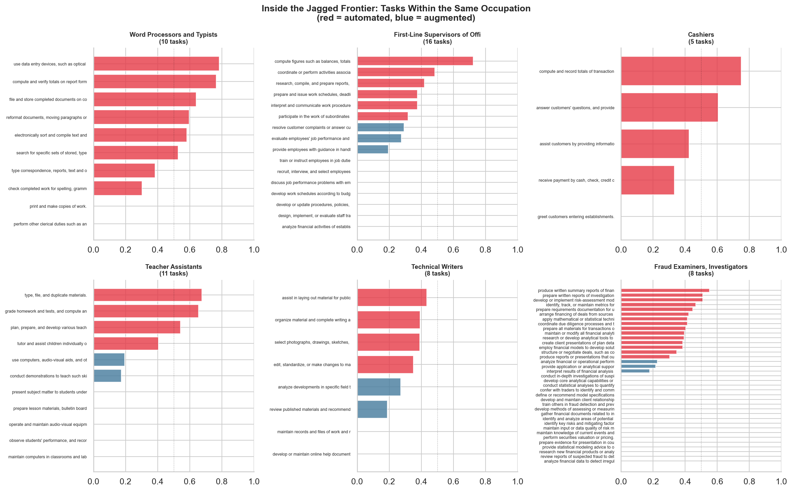
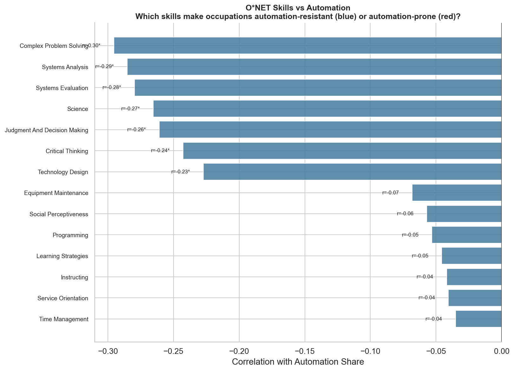

# The Jagged Adoption Frontier

**AI automates what you *produce*, not what you *are*. An empirical analysis of 3,259 occupational tasks.**

Using 12 months of [Anthropic Economic Index](https://www.anthropic.com/economic-index) data, we analyze how AI is actually being used across thousands of real-world tasks. Three findings emerge that challenge conventional wisdom about AI and work.



## Three Findings

### 1. AI automates artifacts, augments interactions

Tasks that produce *artifacts* (reports, code, data, transcripts) are automated at **2x the rate** of tasks that require *human interaction* (advising, counseling, teaching, negotiating).

This holds regardless of skill level. Education barely predicts automation — high-education and low-education tasks automate at the same rate (~26%). What matters is whether the task's output is a **document** or a **relationship**.

| Task type | Automation rate | Examples |
|-----------|:-:|---|
| Content production | 33% | Write reports, draft plans, prepare analyses |
| Data processing | 35% | Calculate, transcribe, convert data |
| Human interaction | 17% | Advise clients, counsel patients, teach students |



### 2. Deployment context determines automation — not the task itself

The same O\*NET task shows radically different automation rates depending on *how* AI is deployed. On average, API use (programmatic pipelines) is **+25 percentage points** more automated than Claude.ai (interactive) for the same task.

Some tasks go from **0% automated on Claude.ai to 100% automated on API.** The automation question isn't "can AI do this?" — it's "will organizations embed AI in automated pipelines for this?"



### 3. Jobs don't automate — tasks do

Every occupation is a *bundle of tasks*. Within the same job, some tasks are 90%+ automated while others are 0% automated. A Word Processor's transcription tasks are fully automated, but their document formatting tasks require human judgment.

This within-occupation heterogeneity is why occupation-level prediction fails (**R^2 ~ 0**). But at the task level, prediction works (**R^2 = 0.29** cross-validated). The signal exists — it's just at the wrong level of analysis.



### Bonus: The automation-success paradox

Automated tasks have **lower success rates** than augmented tasks (62% vs 82%). This isn't because automation fails — it's because people use AI autonomously for *harder, more ambitious* work where perfect success isn't expected.

## What skills predict automation resistance?

O\*NET skill profiles predict automation patterns better than wage does. Occupations requiring **social perceptiveness**, **persuasion**, and **service orientation** resist automation. Equipment-related skills correlate with higher automation.



## The implication

"Will AI replace my job?" is the wrong question. The right questions are:

1. Which **tasks** in my job produce artifacts vs. require human interaction?
2. How is my organization **deploying** AI for those tasks?
3. What **skills** make me irreplaceable for the interaction tasks?

## Data

All data is publicly available and downloads automatically.

| Source | Description |
|--------|-------------|
| [Anthropic Economic Index](https://huggingface.co/datasets/Anthropic/EconomicIndex) | 4 releases (Mar 2025 -- Mar 2026): per-task AI autonomy, education estimates, collaboration modes, success rates |
| [O\*NET](https://www.onetonline.org/) | 19,530 task statements mapped to 974 occupations + 35 skill ratings per occupation |
| [BLS OEWS](https://www.bls.gov/oes/) | Wage and employment data |

## Methodology

**Task-level analysis.** Standard AI labor economics analyzes occupations. We analyze 3,259 individual tasks — recovering predictive signal that occupation-level aggregation destroys.

**Task taxonomy.** We categorize tasks by their leading verb (write, advise, compute, etc.) into output types: artifact-producing, interaction-requiring, and others.

**Platform comparison.** We match tasks across Claude.ai (interactive) and API (programmatic), measuring per-task automation divergence across 2,429 matched tasks.

**Predictive modeling.** XGBoost and Gradient Boosting predict task-level AI autonomy (cross-validated R^2 = 0.29) from education requirements, time estimates, success rates, and collaboration mode distributions.

**Skill profiling.** O\*NET skill importance ratings identify which occupational skill profiles predict automation resistance.

## Limitations

- **Single platform.** All data is from Claude. Patterns may differ on ChatGPT or other AI systems.
- **Observational.** We identify associations, not causal mechanisms.
- **12-month window.** Short for labor market trends. Patterns may shift.
- **Task taxonomy is rough.** First-verb classification is a heuristic; some tasks defy simple categorization.
- **R^2 = 0.29** means 71% of task-level variance remains unexplained.

## Project Structure

```
├── notebooks/
│   ├── 01_data_acquisition.ipynb    # Data download and quality assessment
│   ├── 02_skill_compression.ipynb   # The artifact-interaction divide
│   ├── 03_task_level_analysis.ipynb  # Platform divergence and prediction
│   ├── 04_jagged_frontier.ipynb     # Within-occupation heterogeneity
│   └── 05_synthesis.ipynb           # Summary and implications
├── src/
│   ├── data.py       # Data pipeline (HuggingFace + O*NET + BLS)
│   ├── features.py   # Feature engineering (task + occupation level)
│   └── model.py      # Predictive models
├── figures/           # Generated visualizations
└── data/              # Auto-downloaded datasets
```

## Reproducing

```bash
git clone https://github.com/alvinekelund/AI-vin-Index.git
cd AI-vin-Index
pip install -r requirements.txt
jupyter nbconvert --execute notebooks/01_data_acquisition.ipynb --to notebook
jupyter nbconvert --execute notebooks/02_skill_compression.ipynb --to notebook
jupyter nbconvert --execute notebooks/03_task_level_analysis.ipynb --to notebook
jupyter nbconvert --execute notebooks/04_jagged_frontier.ipynb --to notebook
jupyter nbconvert --execute notebooks/05_synthesis.ipynb --to notebook
```

## References

- Anthropic. (2025--2026). *The Anthropic Economic Index.* [anthropic.com/economic-index](https://www.anthropic.com/economic-index)
- Dell'Acqua, F., et al. (2023). *Navigating the Jagged Technological Frontier.* Harvard Business School.
- Eloundou, T., et al. (2023). *GPTs are GPTs.* arXiv:2303.10130.
- Acemoglu, D. (2024). *The Simple Macroeconomics of AI.* NBER Working Paper 32487.

## License

MIT. Underlying data provided by Anthropic, O\*NET, and BLS under their respective terms.
