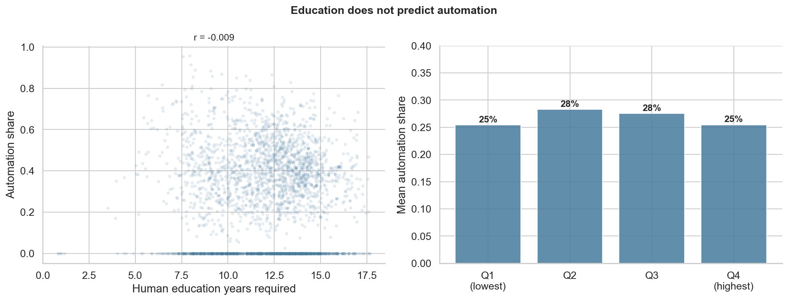
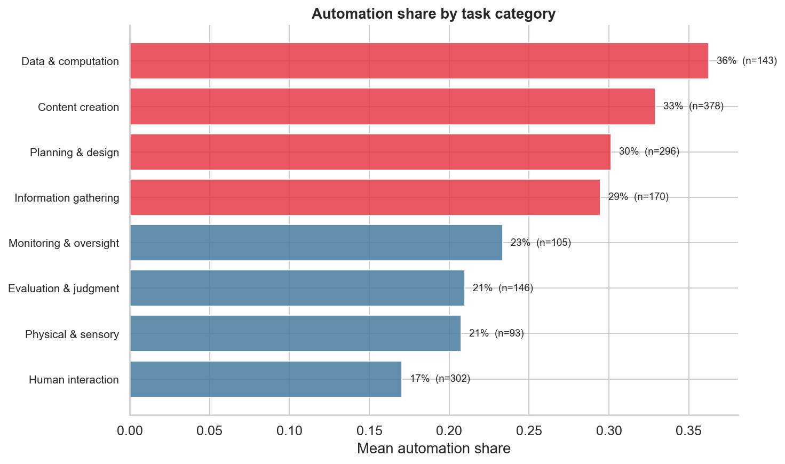
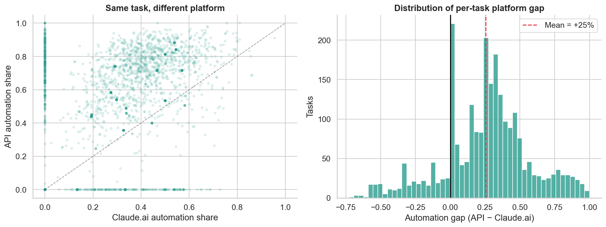
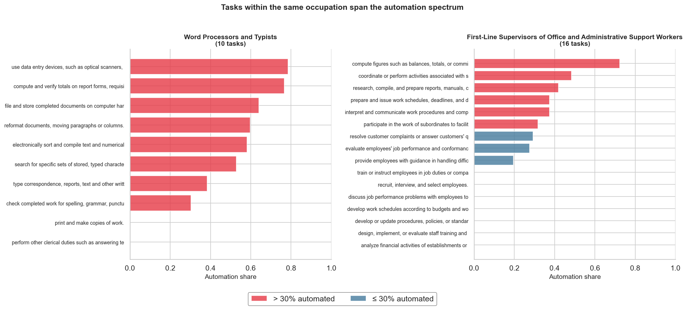

# The Jagged Adoption Frontier

**What determines whether people use AI as an autonomous tool or as a collaborator?**

Anthropic's [Economic Index](https://www.anthropic.com/economic-index) classifies a sample of Claude conversations by O\*NET occupational task and collaboration mode. Using the March 2026 release (3,259 tasks, 425K rows), we find that AI automation is not driven by skill level — it is driven by what the task produces and how the AI is deployed.

## Findings

### 1. What the task produces matters. Education does not.

The most common assumption about AI and work is that low-skill, routine tasks get automated first. In this data, education requirements have **zero predictive power** over automation share (r = −0.009, p = 0.64). Tasks requiring 8 years of education automate at the same rate as tasks requiring 16.

What *does* predict automation is the nature of the output. Tasks that produce **artifacts** — reports, transcripts, data transformations — are automated at 35%. Tasks that require **human interaction** — advising, teaching, negotiating — are automated at 17%. This 18pp gap is large (Cohen's d = 0.89, p < 10⁻²⁶) and holds within every education quartile.



The gradient is smooth across finer task categories. Data entry and transcription tasks automate at 36%. Content creation at 33%. At the other end: evaluation and judgment at 21%, human interaction at 17%.



Concretely: "transcribe recorded proceedings" is 86% automated. "Explain exercise program to participants" is 0%. Both require similar education. They differ in whether the output is a document or a conversation.

### 2. Deployment swings automation more than the task itself

The same O\*NET task shows radically different automation rates depending on whether people access Claude via the **API** (programmatic, embedded in pipelines) or **Claude.ai** (interactive, conversational). Across 2,429 matched tasks, API automation averages 57% vs. 32% on Claude.ai — a 25 percentage point gap. 44 tasks go from under 5% automated on Claude.ai to over 90% on API.

The model is the same. What changes is the deployment context. When a task is embedded in an automated pipeline, it becomes directive by construction.



### 3. "Will AI automate this job?" is the wrong question

The chart below shows two occupations. In each, some tasks are heavily automated (red) and others barely touched (blue) — within the same job title. Word Processors and Typists ranges from "answer telephones" at 3% automation to "use data entry devices" at 71%. First-Line Supervisors ranges from "analyze financial activities" at 7% to "compute figures such as balances and totals" at 78%.

This pattern holds broadly: among 319 occupations with 5+ tasks, the median within-occupation range in AI autonomy is 0.64 points on a 1–5 scale. The right unit of analysis is the task, not the occupation.



## Data

All data downloads automatically from [Anthropic/EconomicIndex](https://huggingface.co/datasets/Anthropic/EconomicIndex) on HuggingFace. O\*NET task statements provide the occupation mapping.

The Economic Index classifies each Claude conversation into one of five collaboration modes:

| Mode | Category | Description |
|------|----------|-------------|
| Directive | Automation | Human gives instructions, accepts output |
| Feedback loop | Automation | AI-driven iteration with minimal human input |
| Task iteration | Augmentation | Human iterates on AI drafts |
| Validation | Augmentation | Human checks AI output |
| Learning | Augmentation | Human learns from AI |

**Automation share** = directive + feedback loop share of a task's conversations.

Four releases span March 2025 to March 2026. The March 2026 release adds 34 per-task facets (AI autonomy scores, education year estimates, success rates) beyond collaboration modes. We use the March 2026 release for all cross-sectional analysis.

## Limitations

- **Single platform.** All data is from Claude. Patterns may differ on other AI systems.
- **Observational.** We document associations, not causal effects.
- **Task classification is coarse.** Categorizing tasks by their leading verb is a rough heuristic.
- **12-month window.** These patterns may shift as AI capabilities and user behavior evolve.

## Reproducing

```bash
git clone https://github.com/alvinekelund/AI-vin-Index.git
cd AI-vin-Index
pip install -r requirements.txt
jupyter nbconvert --execute notebooks/01_data_acquisition.ipynb --to notebook
jupyter nbconvert --execute notebooks/02_skill_compression.ipynb --to notebook
jupyter nbconvert --execute notebooks/03_task_level_analysis.ipynb --to notebook
```

## Structure

```
notebooks/
  01_data_acquisition.ipynb     Data download and construction
  02_skill_compression.ipynb    Output type vs. education as predictors
  03_task_level_analysis.ipynb  Platform gap and within-occupation variation
src/
  data.py                       Data pipeline
  features.py                   Feature engineering
```

## License

MIT. Underlying data provided by Anthropic and O\*NET under their respective terms.
